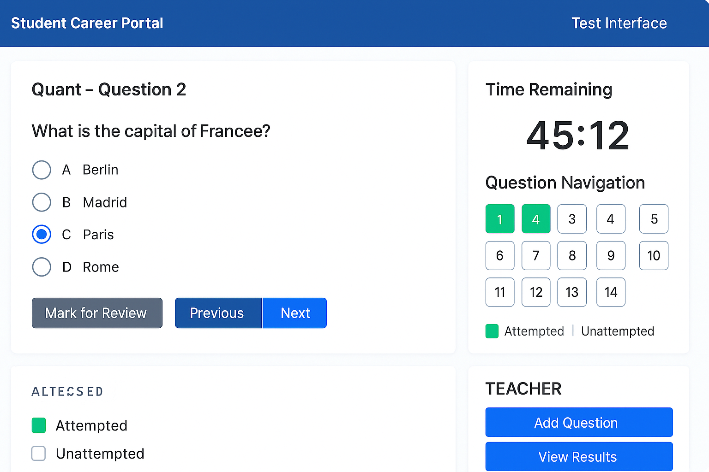

# 🎓 Student Career Portal

A web-based application built with Django that allows students to take career-oriented tests and teachers/admins to manage test questions and evaluate student performance.

## 🚀 Features

### 👨‍🎓 For Students
- Secure login and registration
- Take objective-based tests
- Navigate between questions (Next/Previous)
- Mark answers for review
- Update responses before submission
- View attempted/unattempted question grid

### 👩‍🏫 For Teachers/Admins
- Secure login
- Add, edit, and delete questions and options
- View student responses and scores
- Role-based access (Student/Teacher)

### 📦 APIs
- Save user answers via AJAX
- Fetch questions dynamically
- Real-time progress tracking and UI update

## 🛠️ Tech Stack

| Component      | Technology         |
|----------------|--------------------|
| Backend        | Django (Python)    |
| Frontend       | HTML, CSS, JavaScript (jQuery) |
| Database       | SQLite (default) or MySQL/PostgreSQL |
| Authentication | Django's built-in auth |
| APIs           | Django REST Framework |


## ⚙️ Setup Instructions

1. **Clone the repo:**
   ```bash
   git clone https://github.com/your-username/student-career-portal.git
   cd student-career-portal


2. **Create and activate a virtual environment:**
   ```bash
   python -m venv env
   source env/bin/activate   # On Windows use `env\Scripts\activate`


3. **Install dependencies:**
   ```bash
   pip install -r requirements.txt

4. **Apply migrations:**
   ```bash
   python manage.py migrate

5. **Create a superuser:**
   ```bash
   python manage.py createsuperuser

6. **Run the development server:**
   ```bash
   python manage.py runserver
7. **Access the app:**
   
     Student/Teacher Login: http://localhost:8000/accounts/login/

   Admin Panel: http://localhost:8000/admin/
